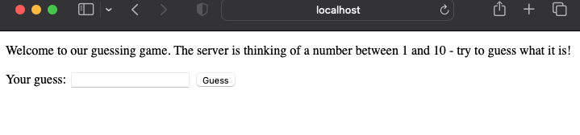

# Getting started with Node.js
Node.js is a runtime for JavaScript, and we will be using it throughout this course.  It works
on all major operating systems.

## Download the runtime
Go to [nodejs.org](https://nodejs.org/en/download/) and select the install for your operating system.

*On Windows, during the install, please make sure you select "Add to Path" if presented with that option*

## Test it out
Once you've installed it, open a Command Prompt (Windows) or Terminal (MacOS).  

Type `node -v` https://pages.ramapo.edu/~sfrees/courses/cmps369/images/guess.png

You should see the version number print out.  If you do (and you don't get any ugly error messages), then you are ready to go!

## Run a web app!
Download a sample application - [guessing-demo.zip](../code/guessing-demo.zip).  Extract it to a directory on your computer, and navigate to the directory using the Command Prompt or the Terminal.

Need help with Command Prompt (Windows)?
- [https://www.makeuseof.com/tag/a-beginners-guide-to-the-windows-command-line/](https://www.makeuseof.com/tag/a-beginners-guide-to-the-windows-command-line/)

Need help with Terminal (MacOS)?
- [https://developer.mozilla.org/en-US/docs/Learn/Tools_and_testing/Understanding_client-side_tools/Command_line](https://developer.mozilla.org/en-US/docs/Learn/Tools_and_testing/Understanding_client-side_tools/Command_line)

Once you are in the folder, you can type `dir` for Windows, or `ls` for MacOS or Linux, you should see the following files and folders listed:
```
guess.js        package.json    public          templates
```
You can go ahead and peek inside `guess.js` if you want to take a look at what we will be running - it's a simple web server that is going to implement a numeric guessing game.  Before we can run it, we need to install the dependencies the code uses.  Do this by typing:

```
npm install
```

`npm` stands for **n**ode **p**ackage **m**anager.  You might see a few warnings - some of the dependencies I've used are a little outdated, but you should see no errors.

Now we are ready to run the app - type 
```
node guess.js
```
Nothing should happen.  The web server is running, and listening for incoming connections over port `8080`.  

Now, open up a web browser, and enter [http://localhost:8080/start](http://localhost:8080/start) into the address bar.

Enjoy a nice game of guessing a number - you have run your first local web application! <span style='font-size:x-large'>&#128512;</span>



