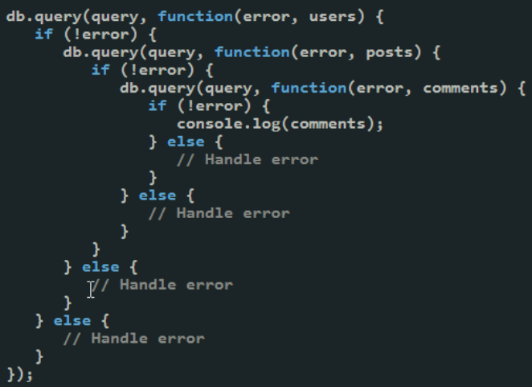

title: CMPS 369 Async
---
class: center, middle, title_slide
# Async in Node
## Asyncronous Stream Reading

---
# Agenda
- Creating an easier to use body parser
  - Callbacks and Promises
  - Async/Await

---
# The problem
Here's how we read the body for form data in our first guessing game.
```js
let body = "";
req.on('data', (chunk) => {
    body += chunk;
});
req.on('end', () => {
    body = qs.parse(body);
    if (body.guess < body.secret) {
        send_page(res, make_guess_page(body.secret, 'too low'));
    } else if (body.guess > body.secret) {
        send_page(res, make_guess_page(body.secret, 'too high'));
    } else {
        send_page(res, `<h1> Great job!</h1> <a href="/">Play again</a>`);
    }
});
```
It's not clear how we would put this in a function... so we could reuse it.

---
# Naive Attempt
```js
const parse_body = (req) => {
    let body = "";
    req.on('data', (chunk) => {
        body += chunk;
    });
    req.on('end', () => {
        body = qs.parse(body);
        return body;
    });
}
```
**This fails, miserably**.  This is because the function returns immediately - we've attached **callback** functions that get called when 
data is read, and data is complete - but by definition, they haven't been called yet.

---
# Single Threaded Node
In Node.js, we have one thread, and only one thread.  Two things cannot happen at the same time.

When we are executing our code to add callbacks, by definition the stream is not being read...

In the background, Node.js queues I/O tasks and performs them when your code
is "done".  It then **calls your code back** using the functions you provide.

---
# A callback interface
We can modify our function to use callbacks - hiding **some** of the details.

```js
const parse_body = (req, done) => {
    let body = "";
    req.on('data', (chunk) => {
        body += chunk;
    });
    req.on('end', () => {
        body = qs.parse(body);
        return done(body);
    });
}
```
Then the caller can do this:
```js
parse_body(req, (body) => {
    if (body.guess < body.secret)
        send_page(res, make_guess_page(body.secret, 'too low'));
    else if (body.guess > body.secret)
        send_page(res, make_guess_page(body.secret, 'too high'));
    else 
        send_page(res, `<h1> Great job!</h1> <a href="/">Play again</a>`);
})
```

---
# What about errors?
.split-left[
Most functions should deal with errors, and allow the error to be passed back to the caller.  What if there was an error reading someting?

Node has a convention - callbacks generally accept **two** parameters - an error object, and the result (happy case).
]
.split-right[
```js
const parse_body = (req, done) => {
    let body = "";
    req.on('data', (chunk) => {
        body += chunk;
    });
    req.on('end', () => {
        try {
            body = qs.parse(body);
        } catch (ex) {
            done(ex);
            return;
        }
        return done(null, body);
    });
}

parse_body(req, (err, body) => {
   if(err) {
    // return a 4xx
   } else {
    // generate HTML
   }
})
```
]

---
# Promises - a new convention
For a long time, callbacks were it... and we called it "callback hell".
.split-left[
    
]
.split-right[
    To "fix" this, the Node.js community developed the concept of a "promise", which is an object with **two** callbacks - allowing you to resolve the happy path and error path in two separate functions.
]

---
# Promised Improvement?
.split-left[
Instead of this:
```js
    do_something(params, (err, result) => {
        if (err) {
            //do someting with error
        } else {
            // do something with result
        }
    })
```
]
.split-right[
We had this
```js
    do_something(params).then( (result) => {
        // do something with result
    }).catch((err) => {
        // do something with error
    }
```
]

---
# Why would this be good?
On it's face, this strategy was **a little** cleaner.  

The major improvement was that you could start thinking of promises as real objects - they could be passed around.  They represented future state.

```js
const promise =  do_something(params);

// Do some more stuff, unrelated to the promise

promise.then((result)=> {
    //  do something with result
});
promise.catch((err) => {
    // do something with the error.
});
```

---
# Making Promises
Promises got baked right into Node.js, and then later JavaScript in general (in web browsers).  Included, is the mechanics of **making** a promise:

```js
const p = new Promise( (resolve, reject) => {
    do_something_async(input, (err, result) => {
        if (err) reject(err);
        else resolve(result);
    });
});
p.then((result) => {
    // do something with result
}).catch((err) => {
    // do something with error
})
```
Notice - this is all window dressing, we just hid the original callback style inside the promise object!

---
# Adapting Body Parsing
Using the promise API, we can do the following:

```js
const parse_body = (req, done) => {
    return new Promise((resolve, reject) => {
        let body = "";
        req.on('data', (chunk) => {
            body += chunk;
        });
        req.on('end', () => {
            try {
                body = qs.parse(body);
            } catch (ex) {
                reject(ex)
                return;
            }
            return resolve(body);
        });
    })
}

parse_body(req).then((body) => {
    // generate HTML
}).catch((err) => {
    // return 4xxx
});
```

---
# Hmm...
Okay, you are forgiven if you are wondering... what was the point of all this!

- There were two camps - those that thought this was awesome, and those that sort of shrugged their shoulders.

.callout[
    **However** the promise API has one huge thing going for it... it's a lot easier to standardize around - since the promise is more easily passed back and forth, rather than being a direct callback function.
]

---
# Async / Await
As promises became standard, the language evolved to create **new keywords** to abstract away the ugliness.

When given a promise, you can **await** it!  **await** expects a promise on the right hand side, and effectively **blocks** until the promise is *resovled*.

**await** preserves exception handling semantics - which brings us back to how we are used to handling errors!

.split-left[
```js
parse_body(req).then((body) => {
    // generate HTML
}).catch((err) => {
    // return 4xxx
});
```
]
.split-right[
```js
try {
    const body = await parse_body(req);
    // generate HTML
} catch (err) {
    // return 4xxx
}
```
]

---
# The catch...
The catch with using **await** is that you can **only** use it inside a **function** marked as **async**.  This is because the JavaScript runtime needs to treat these functions differently - in fact, it essentially rewrites your code into a promise-styled callback.

This means you cannot **await** anything in the global scope, only inside functions. 

---
# Putting it all together

.split-left[
```js
const parse_body = (req, done) => {
    return new Promise((resolve, reject) => {
        let body = "";
        req.on('data', (chunk) => {
            body += chunk;
        });
        req.on('end', () => {
            try {
                body = qs.parse(body);
            } catch (ex) {
                reject(ex)
                return;
            }
            return resolve(body);
        });
    })
}
```
]
.split-right[
```js
const handle_post = async (req) => {
    try {
        const body = await parse_body(req);
        if (body.guess < body.secret)
            send_page(res, make_guess_page(body.secret, 'too low'));
        else if (body.guess > body.secret)
            send_page(res, make_guess_page(body.secret, 'too high'));
        else 
            send_page(res, `<h1> Great job!</h1> <a href="/">Play again</a>`);
    } catch (err) {
        res.writeHead(400);
        res.end();
    }
}
```
]

---
# Too complicated?
If this all sounds too complicated, that's natural.  In C++, we read streams quite simply:

```c++
cin >> x ;
```
In C, we do this too
```c++
char buffer[50];
read(fd, buffer, 50);
printf(buffer);
```
This is because most languages treated I/O as **blocking**.  This makes easy programs easy.  However, it leads to performance problems - and is the reason we often use **multithreaded** styles of programming.
.callout[
    If you think `async/await` is tricky... you will love multithreading &#128521; 
]

---
# Power of async
Node.js is actually multithreaded, but it does the multithreaded I/O work itself - it's not your job.  It **forces** I/O to be asynchronous, instead of leaving it as an option through multi-threaded programming.

The `async` model has been widely adopted - it's in Python, Rust, Go (sort of), and others.  It works, and it works well.  You just need to get comfortable with the concept!

.callout[
Not every program benefits from all of this.  **However** please trust me when I say that truly mastering this concept allows you to write incredibly performant code, easily.  It's worth your time, and it's not as complex as you think!
]