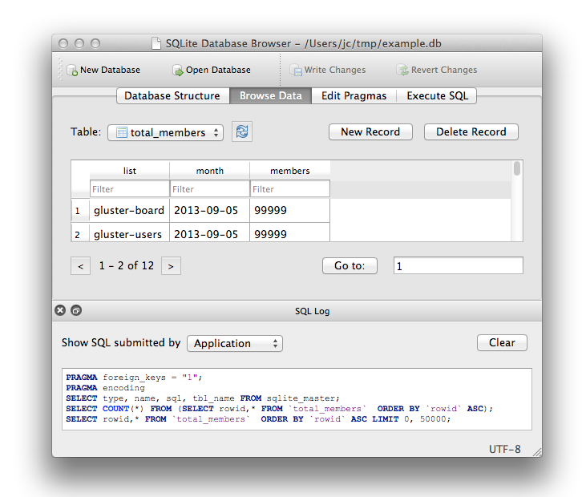

title: CMPS 369 - I/O
---
class: center, middle, title_slide
# Using a Database
## CMPS 369

---
# Motivation
We've modified the guessing game to keep track of games, and their guesses - but we fall short of something of much use... the data get's erased whenever the server is restarted!

.callout[
  If you are starting to think about making sure the server never restarts... **STOP**.  That's an impossible design!
]

---
# Persistence
A database is nothing more than a place to store data that *outlives* the process using the data.  It could be a file, a spreadsheet, or a separate process running on a distributed set of servers storing petabytes of data!

.callout[SQLite is a basic, but extremly powerful database.  It can be used without any special installation.  It is the most widely deployed database technology on earth!]

---
# Using SQLite
For the most part, we will do all database work through Node.js - but it's helpful to use a graphical tool to work with our database in the beginning.

[https://sqlitebrowser.org/](https://sqlitebrowser.org/)



---
# Creating our Tables
Our tables mimick the structure we already stored:

- **Game**
  - ID (auto generated)
  - Secret number
  - Timestamp
  - Number of guesses
  - Completed ?
- Guess
  - Game ID
  - Timestamp
  - Value

---
# Interacting with the database
A database is by definition, I/O - the data is stored on disk.  We will use a third party library to do the actual interaction, and all of it's calls work with **promises**.  

We will use **async/await** extensively.
 
[https://www.npmjs.com/package/sqlite3](https://www.npmjs.com/package/sqlite3)

```
npm install sqlite-async
```
---
# Let's not get hung up here...
This isn't a database class, and I don't want to spend our time talking too much about SQL.  We will revisit some of this when we discuss architecture, however for now:

- Code must create a *connection* to the database - which in most cases is a network socket to talk to another program (the database **program**).
    - However, SQLite is just a library, no other program is running.
- It is good practice to ensure that your application *creates the tables* it needs on start up (or sometime as a separate utility).  This helps keep the database and code structure in sync.
- Data is manipulated via `insert`, `updates` and `delete`, and retrieved using `select`.

.callout[See the code posted for more details, however I have provided a wrapper module for implementing the actual SQL - instead exposing a convenient set of function calls to manipulate the database.]

---
# Database Connection
First off, a good rule of thumb is to never put database configuration information in your code. To connect to databases, you often need the following:

- **Host** - sometimes your database is a program running on your own machine, other times it runs on another machine.  SQLite is just a file, but good habit to think of databases as separate processes.
- **Port Number** - you would need this to connect to a local or remote process
- **Database name** - often databases servers (separate processes) house more than one *logical* database, so you typically need to specify it.
- **Credentials** - the most important thing to **NEVER** put in your code is `username` and `password`.

.callout[
  In Node.js, we use `.env` files to store configuration data.  We can install it with 

  ```
  npm install dotenv
  ```
]

---
# `.env` File
Your `.env` file is just a name value pair sequence, 
```
DBPATH=./guess.db
```
In your JavaScript code, early (as close to the top of the file as you can), you load the `.env` file:

```js
require('dotenv').config()
```