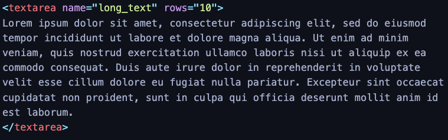

title: CMPS 369 - HTML Forms
---
class: center, middle, title_slide
# Input with HTML Forms
## CMPS 369

---
# User Input
So far we've create HTML content, and even done some dynamic generation - but we haven't responded to any user input (other than the URL they enter!)

Web Applications are a two-way dialog - users will almost always be entering information, and we gather this information through **forms**.

Forms contain user controls - *text boxes, password boxes, checkboxes, drop downs, and more*.

<input name="foo" placeholder="a text input box"/>
<br/>
<select><option>Option 1</option></select>
<br/>
<input type='checkbox' id='c1'/><label for='c1'>Checkbox</label>
<br/>
<input type='radio' id='r1' checked/><label for='r1'>Option 1</label>
<input type='radio' id='r2'/><label for='r2'>Option 2</label>

---
# Form
All user input elements should be contained within a `form` element.  The `form` element itself has no visual effect, but imparts functionality for managing user input.

.split-left[
```html
<form action="/destination" method='post'>
    <h3>Name Form</h3>
    <input name='first'/>
    <br/>
    <input name='last'/>
</form>
```
]
.split-right[
<form action="/destination" method='post'>
    <h3>Name Form</h3>
    <input name='first'/>
    <br/>
    <input name='last'/>
</form>
]

---
# Text input and Submit
Traditionally, form data (user input) is sent to a web server, and this is specified by the `action` and `method` attributes.  The data is sent when the form is **submitted**.

.split-left[
```html

<form action="/destination" method='post'>
    <h3>Name Form</h3>
    <input name='first'/>
    <br/>
    <input name='last'/>
    <br/>
    <button type='submit'>Submit</button>
</form>
```
]
.split-right[
<form action="/destination" method='post'>
    <h3>Name Form</h3>
    <input name='first'/>
    <br/>
    <input name='last'/>
    <br/>
    <button type='submit'>Submit</button>
</form>
]

.callout[When the user clicks the **submit** button, an HTTP **post** method is involved, sending a request to `/destination`]

---
# Text input and Submit
Traditionally, form data (user input) is sent to a web server, and this is specified by the `action` and `method` attributes.  The data is sent when the form is **submitted**.


The **name** attribute on input fields is CRITICAL - without it, the data will not be sent to the server.

.split-left[
```html

<form action="/destination" method='post'>
    <h3>Name Form</h3>
    <input name='first'/>
    <br/>
    <input name='last'/>
    <br/>
    <button type='submit'>Submit</button>
</form>
```
]
.split-right[
```
POST /destination HTTP/1.1
Host: foo.example
Content-Type: application/x-www-form-urlencoded
Content-Length: 18

first=xxx&last=yyy
```
]


---
# Submit Buttons and Buttons
.split-left[
```html
    <button type='submit'>Submit</button>
    <br/>
    <button type='button'>Nothing</button>
    <br/>
    <button type='reset'>Reset</button>
```
It's important to remember that any action taken on the form **only** includes form elements within said form!
]

.split-right[
- **submit** invokes an HTTP request with the fields contained within the form - as either a **get** or **post**
- **button** purely cosmetic - great for JavaScript, but does not tell the browser to do anything itself
- **reset** resets (clears) all the form elements within the form.

]

---
# Handling Form submission
When a form is submitted, it is sent as a series of **name** / **value** pairs. 

Browsers accept either **GET** or **POST** as the `method` the form will be submitted.
- GET will result in the user input (name value pairs) being sent as a **query string** - part of the URL.  The data appears right in the address bar!
    - `/destination?first=xxx&last=xxx`
- POST will result in the user input being sent as the **message body** of the POST request - they are somewhat hidden from the user (out of sight, but still quite available!)

.callout[Using GET makes sense if you want input to be in a shareable address (think Google Maps, where destination will be in the full URL), but usually POST makes the most sense.

POST permits more data to be sent, as the URL of a GET request (including the query string) is generally limited ot a few thousand characters.]

---
# Text Input Types
Basic text input comes in a variety of forms:

```html
<input type="text" value="Hello"/>
<br/>
<input type="number" step="1" max="42" min="12" value="42"/>
<br/>
<input type="password" value="not very secret"/>
<br/>
<input type="hidden" value="not very hidden"/>

```
<input type="text" value="Hello"/>
<br/>
<input type="number" step="1" max="42" min="12" value="42"/>
<br/>
<input type="password" value="not very secret"/>
<br/>
<input type="hidden" value="not very hidden"/>

---
# Attributes
Text input has several useful attributes:
.split-left[
```html
<input type="text" placeholder="Say hello!" value="Hello"/>
<br/>
<input type="text" readonly value="Hello"/>
<br/>
<input type="text" disabled value="Hello"/>
<br/>
<input type="text" required value="Hello"/>
<br/>
```
]
.split-right[
    <input type="text" placeholder="Say hello!"/>
<br/>
<input type="text" readonly value="Hello"/>
<br/>
<input type="text" disabled value="Hello"/>
<br/>
<input type="text" required value="Hello"/>
<br/>
]

**required** has the effect of telling the browser **not** to submit the form if the element has no value.  Useful for prototyping, but limited in terms of user input validation.

---
# Text Area
Larger text fields are best represented with the `textarea` element:

.split-left[
    
]
.split-right[
    
]
---
# Labels
Normally we place labels with input fields to tell the user what the fields represent.

```html
<label for='my_input'>My Input</label>
<input name="my_input"/>
```
The **placeholder** attribute is a popular substitution for this, but it only makes sense for regular text and text area boxes.  It's also problematic, since once user input is entered the placeholder text is no longer displayed.

.callout[
    Labels are **semantically** tied to the input field.  Clicking the label places keyboard focus on the input field.  Screen readers can also use labels for assistive technology.
]

---
# Check box
Checkboxes are the preferred "on" "off" switch - and can actually be styled as such (we will see later).

**Important:** checkboxes do not carry any text, they must have labels!

```html
<div>
    <input type="checkbox" name="option_yes_no"/>
    <label for="option_yes_no">Yes or No?</label>
</div>
<div>
    <input type="checkbox" name="option_yes_no" checked/>
    <label for="option_yes_no">Yes or No?</label>
</div>
```

<div>
    <input type="checkbox" name="option_yes_no"/>
    <label for="option_yes_no">Yes or No?</label>
</div>
<div>
    <input type="checkbox" name="option_yes_no" checked/>
    <label for="option_yes_no">Yes or No?</label>
</div>
.callout[
    Notice `checked` is a value-less attribute - if it exists, the checkbox is checked.
]
---
# Radio 
Radio buttons are a lot like checkboxes, but they form a **group**.  The options are **mutually exclusive**.

```html
<input type="radio" id="A" name="option" value="A"/>
<label for="A">A</label>
<input type="radio" id="B" name="option" value="B" checked/>
<label for="B">B</label>
<input type="radio" id="C" name="option" value="C"/>
<label for="C">C</label>
```


Notice the use of the **id** attribute.  
.callout[**IN ORDER FOR THE RADIO BUTTONS TO BE CONNECTED, THEY MUST SHARE THE SAME NAME**]

---
# Select
The last of the most common inputs is the **select** drop down.

```html
<select name='choice'>
    <option value="value1">Value 1</option>
    <option value="value2" selected>Value 2</option>
    <option value="value3">Value 3</option>
</select>
```
The `value` attribute is what is sent to the server, while the contents of the `option` element itself is displayed. 

The **selected** attribute control which option is initially selected.  Note - if you have a reset button, the reset will select the originally chosen option.
---
# Others
- Text Input Variations
    - `input type='file'`
    - `input type='date'`
    - `input type='color'`
    - `input type='search'`
    - ... and more

- Multi-select `select`

.callout[
    Styling goes a long way, and often more exotic controls are created from CSS and JavaScript, and superimposed on top of the standard ones.  **When in doubt**, KEEP IT SIMPLE though!
] 

---
# Guessing Game
We will use a simple guessing game as a running example throughout the semester.

On each page load to `/start`, a random number will be selected by the server, and we will accept a "guess" by the user.  

The input form will submit, and the response will be an HTML page telling the user their numeric guess was either too high, or too low - or just right!

Let's use **POST**, since that is the most common way to submit forms, and let's learn some tricks of the trade to make sure we can remember the "secret" number selected by the


