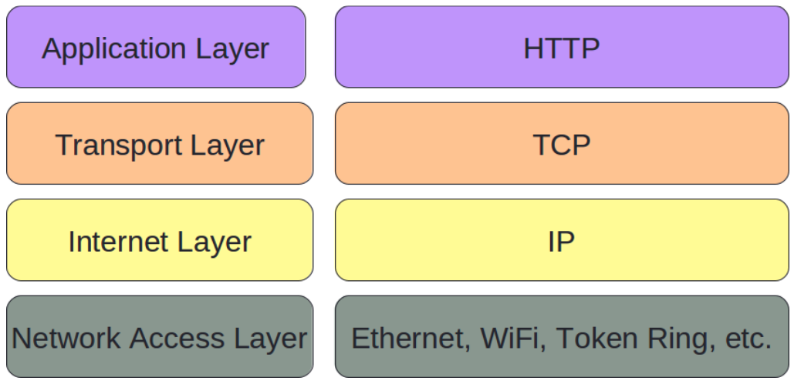
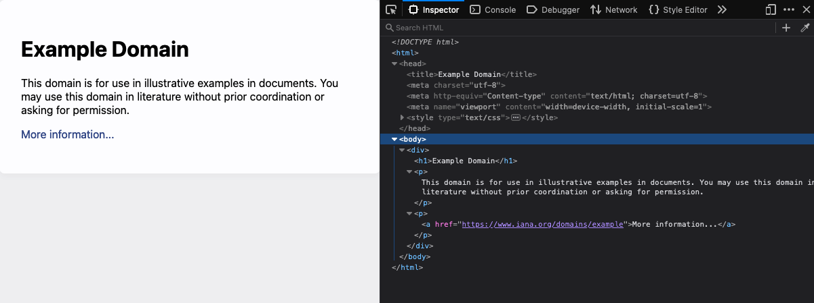
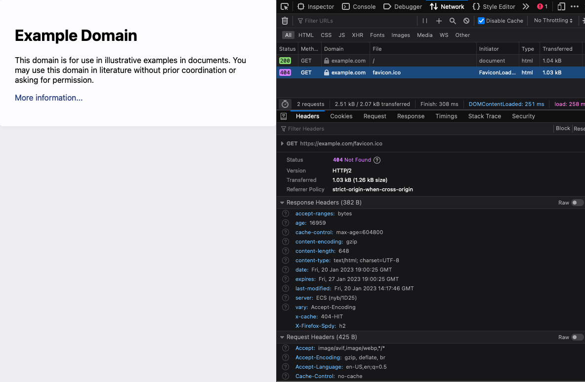

title: CMPS 369 - Networks
---
class: center, middle, title_slide
# HTTP, DNS, and the web
## CMPS 369

---
# HTTP
Last time, we build an echo server...
- We made assumptions:
    - Port number
    - Communication flow
    - Message format
    - Expected response
- A **web server** uses the assumptions of the web:
  - Listens for connections on a TCP socket on port 80
    - Port numbers < 1024 are usually reserved
    - 80 is reserved for HTTP, by convention.
    - Other protocols use other ports by convention
    - No protocol is tied only to a specific port, however
- A **web browser** connects to a machine at a known IP address at port 80.
  - The browser sends a request
  - The server responds with information (maybe a web page)
  - The **format** of the request/response is defined by the **HTTP PROTOCOL**

---
# Request and Response
99.999% of all actions ever taken on the web follow a strict **request** and **response** cycle:

- A client (browser) sends an HTTP **request** to a server - asking it to do something
  - The *something* could be a lot - but for example, "send me a web page".
- A server **responds** to the request
  - Again, the response could be almost anything - but often it is a web page!

.callout[99.999% is an underestimate.  Web Sockets are the only exception, and they are relatively new, and not used for anything by very, *very* specific use cases.]

**It is very important to remember this** - all things on the web follow a ONE request, ONE response model.

---
# Making Requests and Sending Responses
- Requests and responses are sent via TCP socket
- The connection process is **exactly** the same as any other network communication.
- **What** is being sent is what defines the web - **all requests and response are formatted in plain text, with a protocol called HTTP**

.callout[Since the most basic HTTP action is to request a web page, let's look at the parts to this first.]

**First up:** Identifying how to reach a machine, and how to talk to it!

---
# The URL
**URL** stands for **U**niform **R**esource **L**ocator

The format of a URL has 4 components
<span style='color:blue'>scheme</span>://<span style='color:orange'>domain</span>:<span style='color:red'>port</span>/<span style='color:green'>path</span>

The <span style='color:blue'>scheme</span> represents the protocol to be used.  Examples include
 - http
 - ftp
 - mailto

The <span style='color:orange'>domain</span> is the server address
- 127.0.0.1
- www.google.com
- www.ramapo.edu

<span style='color:red'>port</span> is self-explanatory, and we will discuss <span style='color:green'>path</span> soon.

---
# URL to socket
When you type <span style='color:blue'>http://www.ramapo.edu</span> into a web browser's address bar, you tell it o:
- Establish a TCP/IP connection with a machine named **www.ramapo.edu**.
- Because the <span style='color:blue'>scheme</span> is **http**, the browser knows that it will be using http to communicate.  HTTP defines the **default** port to be 80 when not specified.
- The path, when not given, is assumed to be the root - **/**

.callout[The browser knows what to do... almost.  It cannot create a socket connecting to www.ramapo.edu because that is not an IP address, it is a human-friendly name.]

The browser's first job is to **resolve** the domain name to an IP address.  This isn't part of **http**, it's a basic service of the general internet - called **DNS**.

---
# Domain Name Service
- Each computer has an IP address (or several) for another machine that is responsible for helping it *resolve* domain names to IP addresses.

- This machine is sometimes called a *gateway*, and it is configured when you connect to a network.

- The *gateway* machine (probably maintained by your ISP) has listings of *name servers*, which form a network of machines that maintain a **distributed** database of domain names and IP addresses.

- Nameservers are maintained by a variety of organizations - big and small.  Ramapo has names servers that have information about machines on campus.  Top-level registries maintain listings of millions and millions of machines (Verisign)

- At the highest level, the **Internet Corporation for Assigned Names and Numbers** - ICANN - maintains the information to weave it all together.

---
# Resolving IP Addresses
Your operating system contains C programming APIs that allow programs to create sockets, do networking, etc.  **In addition**, it has function calls to resolve domain names!

Your web browser will invoke these function calls, which in turn communicate with your *gateway* and the internet's *nameservers* to resolve IP addresses.

We can see this at work, using the `ping` utility - a program that ships with most operating systems:

```
% ping example.com
PING example.com (93.184.216.34): 56 data bytes
64 bytes from 93.184.216.34: icmp_seq=0 ttl=59 time=7.015 ms
64 bytes from 93.184.216.34: icmp_seq=1 ttl=59 time=13.758 ms
64 bytes from 93.184.216.34: icmp_seq=2 ttl=59 time=12.532 ms
64 bytes from 93.184.216.34: icmp_seq=3 ttl=59 time=9.356 ms
```
```
% ping facebook.com
PING facebook.com (31.13.71.36): 56 data bytes
64 bytes from 31.13.71.36: icmp_seq=0 ttl=58 time=8.716 ms
64 bytes from 31.13.71.36: icmp_seq=1 ttl=58 time=10.278 ms
64 bytes from 31.13.71.36: icmp_seq=2 ttl=58 time=13.109 ms
64 bytes from 31.13.71.36: icmp_seq=3 ttl=58 time=16.054 ms
```
---
# Resolving IP Addresses
The first step to finding **www.ramapo.edu** is to look up it's TLD.  For example, **ramapo.edu** is registered at the top-level domain `edu`, accessible to the public.  This tells us nameservers that know about that domain.

.split-left[
```
% whois www.ramapo.edu
Domain Name: RAMAPO.EDU

Registrant:
	Ramapo College
	505 Ramapo Valley Road
	Mahwah, NJ 07430-1680
	USA

Name Servers:
	NS1.P20.DYNECT.NET
	NS2.P20.DYNECT.NET
	NS1.RAMAPO.EDU
	NS3.P20.DYNECT.NET
	NS2.RAMAPO.EDU
	NS4.P20.DYNECT.NET

Domain record activated:    07-May-1991
Domain record last updated: 22-Oct-2021
Domain expires:             31-Jul-2024
```
]
.split-right[
  .callout[Name servers maintained by Ramapo can be queries to find the specific machine we are looking for - `www.ramapo.edu`.]
]

---
# What are we sending?
Armed with an IP address, the web browser can now connect to `www.ramapo.edu` with a standard TCP connection.  **At this point, ANYTHING could be sent to the www.ramapo.edu server**. 

Again, since the **scheme** was `http`, the browser knows it needs to speak `http` with the server.

## HTTP: Hyper-Text Transfer Protocol


---
# HTTP Protocol
HTTP is not HTML.  HTTP is the language computers speak to often exchange HTML, but it is not limited to HTML at all.  You can exchange data in any format.

The core to the HTTP protocol is:
- Formatting a **request**, which includes a **verb** and a **noun** (and even some descriptors... like adjectives!)
- Formatting a **response**, which includes a status code, and usually a **payload** - the data requested.

The simplest **request** is the **GET** a thing - like `/`.

```
GET / HTTP/1.1
host: example.com
```
This text, when sent to `example.com`, requests the page at path `/`, using HTTP version 1.1 (the only version we need to discuss).

---
# Who needs a browser?
We could write C code, like during the networking video, to sent HTTP - **it is just plain text**. 

Most operating systems have program called **telnet** - perhaps the most primitive thing above writing your own code.

**telnet** just opens a socket and sends whatever you type to the server.

```
telnet example.com 80

GET / HTTP/1.1
host: example.com
```
.callout[Observer the output.  example.com doesn't know who we are, why we're asking, or what we are doing with the response - it just sends an HTTP response back to us.  **telnet** doesn't know either - so it just prints the result]

---
# Browser is better though
Get used to viewing raw requests and responses, as a web developer you will need to do this **a lot**.  

However, **telnet** is pretty useless.  It's also good to see what the respone will render as.  All modern web browsers come with **web developer tools** to let you see raw requests and responses.



---
# Browser tools
The screen shot below shows Firefox's **network panel**.  This shows you the actuall HTTP protocol being sent and received.  It's nicely formatted, and tremendously helpful.




---
# HTTP Request Message
- **Start Line**
  - Request Method
  - Request URI (Path)
  - HTTP Version
- **Header Fields(s)**
- **Blank Line**
- **Message Body (optional)**

**Request Types**
- **GET** - return a resource (at path specified)
- **POST** - modify resource (at path specified) with message body sent
- **PATCH** - same thing as POST, but used in different contexts
- **PUT** - add new resource (at path specified), with message body sent
- **DELETE** - remove resource (at path specified)

---
# HTTP Requests... for now
Most of the web runs on **GET** and **POST**.  These are the request types that browsers, and HTML, work with.  We will see **PATCH, PUT, DELETE** later in the semester.

In addition, there are two additional requests types that have more technical purposes:
- **HEAD** - returns the same HTTP **headers** that GET would, without the resource.
- **OPTIONS** - returns a list of the available request types supported for the given resource.

.callout[Request type is the **VERB** in an HTTP request, and the **path** is the **NOUN.  Headers add descript detail to the request, and you can almost consider them *adjectives*.]

---
# Headers
There are many headers that are used to describe requests, and responses.  Web Browsers add them to each request they make, and some are set by the underlying HTML, while most others are set by the browser.

- **Host** - The only *required* header for a valid HTTP **GET**, it is used to support virutal hosts.
- **User-Agent** - A plain text string identifying the browser type.
- **Accept** - A list of file types that the browser knows how to handle.
- **Accept-Language** - A list of natural languages that the user would like to see
- **Accept-Encoding** - A list of compression formats the browser can use.

.callout[**Important** - request headers are *suggestions*.  The web server (your code) can look at them, and use them as information when creating a response - or it can ignore them entirely.]

.callout[**Really important** - request headers can lie!  There is absolutely nothing stopping me from sending a header saying that my user agent is Firefox, directly from telnet.]

---
# Some more
Here are some additional headers that the browser sends, which have more technical value
- **Connection** - indicates whether the TCP connection should remain open after the response is sent (`keep-alive` or `close`)
- **Keep-Alive** - indicates number of seconds to keep the connection open after the response
- **Content-Type** - used for requests (POST, PATCH, PUT) or responses, indicating what kind of data is being sent
- **Content-Length** - the message body can be arbitrary length, so this header is sent so the recieve (request or response) knows how much data to read from the socket after the last header is sent.
- **Referrer** - the URL the user is on that initiated this request (the link).  Keep this one in mind... we will talk a lot more about this later.

---
# Responses
A **GET** request to `/index.html` is asking for the resource found in `index.html`.  This may be a file on the server, it may not be - it could be **generated** by the server.  It might be an unknown resource, or it could be a resource that the user isn't allowed to see.  Either way, the server will respond:

.split-left[
**Response Message**
- Status Line
- Header fields
- Blank line
- Message body

**Here's a typical status line:**
```
HTTP/1.1 200 OK
```
]
.split-right[
  **Status codes**
  - 200 - ok, everything is going to be good.
  - 3xx - the resource is somewhere else
    - 301 - moved permenantly
    - 307 - moved temporarily
  - 4xx - bad - it's the client's fault
    - 401 - unauthrorized
    - 403 - forbidden
    - 404 - not found
  - 500 - request was fine, server broke
    - This is sent if the server has a problem
]

---
# MIME Extensions
One of the headers that are valid for requests (POST/PUT/PATCH) and responses is `Content-Type`.  This header is particularly important for **responses**, because the browser needs to do something with the response!

**M**ultipurpose **I**nternet **M**ail **E**xtension
- Top Level Content Types
 - `application`, `audio`, `image`, `text`, `video`, and more
- Common MIME types
 - `text/html`, `text/plain`
 - `image/png`, `image/jpeg`
 - `application/octet-stream`, `application/x-www-form-urlencoded`
 .callout[Again, the header might be a lie (or a mistake).  However, it's pretty important that it is correct - the browser won't be able to render the response, or take appropriate action if it doesn't know what the (ascii-encoded) binary data represents]


---
 # Common response headers
 Response headers often describe meta-data about the resource being returned, which the browser may find useful.  `Content-Type` is critical, as is `Content-Length`.  Here are some others:
 - `Date` - when the response was generated
 - `Server` - plain text string identifying the server software used to generate the response (massive security problem)
 - `Last-Modified` - when the resource last changed - great for cacheing (remember the `HEAD` request!)
 - `Expires` - time after which the resource is no longer valid
 - `Etag` - hash of the resource (kind of like an ECC)
 - `Location` - only used for 3xx responses, to tell the client where the resource moved to.

---
# The response body
**IMPORTANT** The requested resource need not be a file on the server.  
- The server reads the request, and determines the response. 
- The server can generate a response by any means it chooses
  - Reading a file on disk and sending the bytes
  - Generating, programmatically, the response
  - Getting the resource from some other machine and sending the bytes.
**The client never knows how the resource was generated.**

.callout[It's the dynamic part, where responses are programatically generated, that is the most interesting!]


---
 # Putting it all together
 - The response's **status** line has a code, indicating whether the request was ok or not.
 - The response's **headers** will describe to the browser what it is about to receive.
 - A blank line indicates the end of the header list.
 - The response body (`content-length`) begins, and is read by the client.

 .callout[All of this is done by reading from a socket]

 The message body might be HTML.  It could be CSS, JavaScript, or all three.  It could also be a PDF, Excel file, PNG image, MPG4 video, or just about anything else.  It's the browser's responsibility to **do SOMETHING** useful with it.

---
# Back to the code
We looked at a C and a JavaScript version of a web server.  

- Let's look at how the server changes if it is speaking HTTP
  - Hint, it doesn't change that much!

---
# Parsing... blah
What changed? 
- We need to **parse** the request string, properly reading the request and understanding what it means.
- We need to form a response, including headers and message body.

.callout[We've hit our first tedious task, that we would need to repeat for every single web server we write - reading and writing HTTP as plain text]

Let's move up a level.  Node.js comes with an **http** server included.  It's just a TCP server, but it has another layer on top of it:
- We don't need to worry about sockets
- We don't get raw data to process, we get pre-built `request` and `response` objects.
  - The request object represents a fully parsed HTTP request
  - The response object represents an interface for which we can manipulate - and then send.

---
# Up Next
### Now that we know how data can be exchanged - we will start learning about what the data looks like. 
### We start with HTML - the langauge we use to structure documents for the web.
