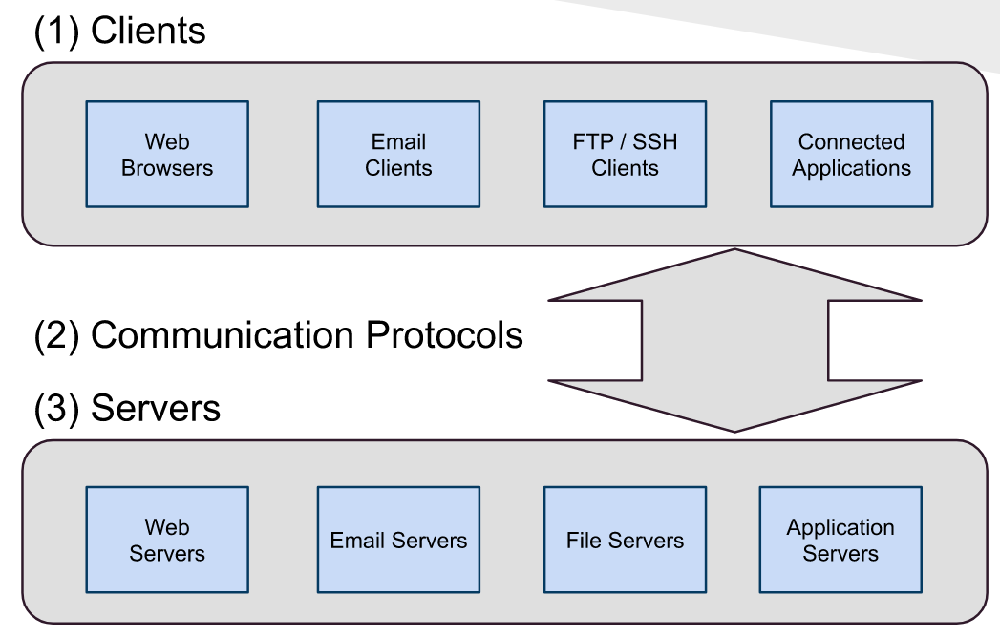
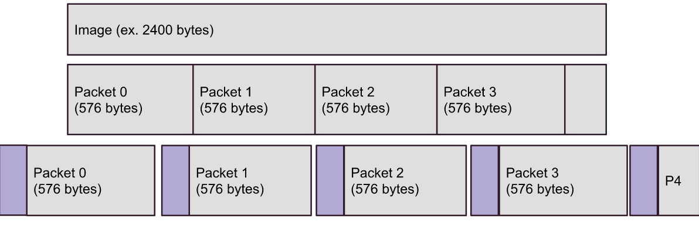
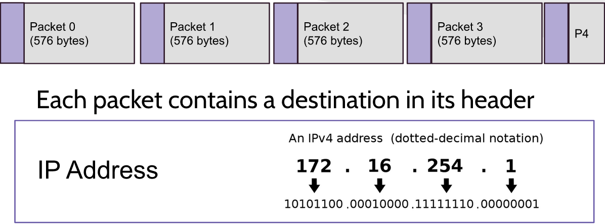
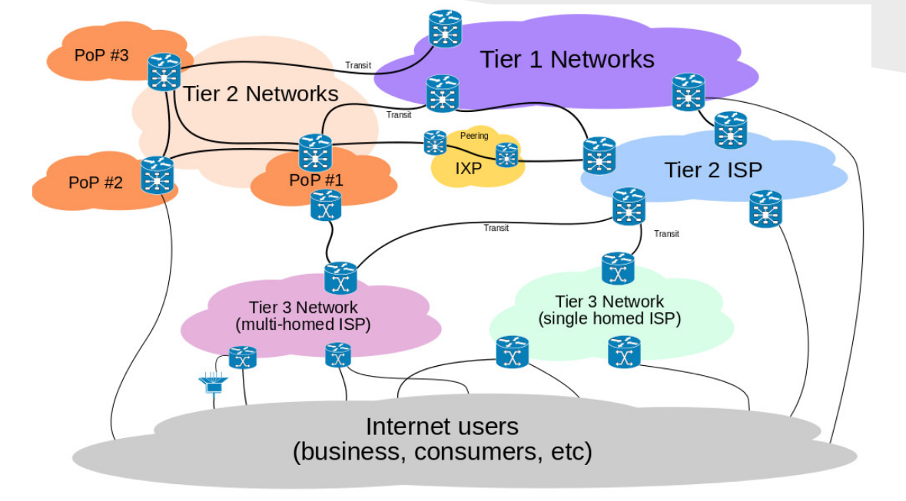

title: CMPS 369 - Networks
---
class: center, middle, title_slide
# Networks and the Internet
## CMPS 369

---
# The Web is just a network
- Computer's exchange data over a network.
- A network is a collection of devices, sending electrical signals
- To be useful:
 - You need to know how to discover devices to talk to.
 - You need to know how to translate electical signals into useful information.

- The **network protocol** defines these, and more.  A network protocol is simply an agreement between communicators.
  - We have a protocol right now...

---
# Networks and why the web is special
- As a software developer, I can rely on the **operating system** to turn text into 1's and 0's and send/recieve over a network (more on this later).
- If I want to build a set of programs on machines that communicate, I can invent my own **protocol**.
    - How do I address my messages?
    - How do I encode my messages?
    - How to I control message flow (who sends what, when, and why)

.callout[I could do this all on my own, but then I'm overworked, but more importantly, limited to communicating with my own programs!]

The **web** is a (large) set of devices and programs that all use the same, mutually agreed upon, **protocol**.  We all speak the same language, in the same way, with the same expectations.

---
# Clients and Servers
The "web" isn't the only standardized protocol.  In fact, some parts of the internet use other protocols, for different purposes.

---
# Communication Protocols
The only thing that goes over the internet is 1's and 0's - the protocol defines how those binary numbers are intepreted.

- A protocol can be standardized (HTTP, SMTP, FTP) or can be custom to  individual sets of applications
  - **However** the days of "custom" protocols are numbered, if not over entirely.
  - The modern internet has shifted towards using HTTP for most things, even if we aren't dealing with web pages and web browsers
    - Great tooling
    - Networks block non-HTTP or at least non-standard protocol traffic
    - There are **niche** use cases that demand different protocols, however.

.callout[To say we use one protocol is too simplistic however, really the **web is build on a stack of standards**.]

---
# The lowest layer
At the lowest layer, communication requires a **method** of sending binary numbers to a **specific machine**.

## IP:  Internet Protocol (1974)
- The most fundamental protocol, and the lowest layer of the stack above the actual hardware
- Provides addressing and message chunking
- All of the **internet** relies on IP.  If you aren't communicating  via IP, then you aren't part of the internet.

.callout[We will discuss IP at a high level, but a networking class (CMPS 327) will cover it in far more detail]

---
# IP Terminology
- All devices that are on the internet are considered **IP hosts**.  They are capable of sending, receiving, and **forwarding** IP messages.

- All hosts must have the ability to encode and decode **IP packets** and be able to participate in **routing** messages.

- Hosts include servers, client computers (web browsers), mobile devices, and dedicated **routers and switches**.

---
# Packets
When a program wants to send a message, the data could be of arbitrary size.
- Let's consider sending an **image** to a destination machine
  - You need to know how to address the destination machine (the mailing address)
  - You also need to **standardize** the **payload** into a series of packets.  
  - *Let's discuss why that is first*.

---
# Why Packets
The internet is called the **web** because it's a web of interconnected IP hosts.  When you send a message, it can flow through the network in many different ways.
- This is a critical design feature:  All router's and switches and intermediatry can't forward messages - so if one path is congested, or down, another path is capable of working.
- Sending **one huge** chunk of data means that entire chunk needs to take the same path - which creates congestion.
- IP breaks the payload up into packets so **each packet** may flow through any path of the internet.
- This reduces congestion, and provides automatic load balancing!

.callout[**Important**: If any packet is corrupt, the entire payload is dropped by the recipient]

---
# Packets and Addressing
IP hosts must be able to process packets of **at least** 576 bytes, however peers can negotiate larger packets if they wish.
- Each packet get's a **header** attached, containing information such as the IP version, total packet size, and other routing flags.

---
# Routing

Each packet is sent to the *first known host* - likely a switch providing primary internet access to the machine.

---
# Routing
Routing is performed by each host on the network:
- When a packet is received, the destination is checked
  - If the host is the destination, OK!
  - If the host can connect directly to the destination, forward it there.
  - Otherwise, **forward** it to another host who has a better idea.

All routers and switches communicate using the **Border Gateway Protocol**, which they use to establish packet sizes, congestion status, and who each machine is good at finding.

---
# Internet Topology

---
# What has been gained?
At the IP level, packets allow the network to distribute a large message among different paths.  It creates **efficiency** and resiliancy.

**However, it does not prevent data curruption**
- 1's and 0's are encoded over a **physical network** as electromagnetic signals (on and off).  This goes for copper wire, light through an ethernet cable, radiowaves, microwaves, and magnetic fields.
- The physical world isn't perfect - **things happen**.  
.callout[A single error in transmission could ruin the message - and all it takes is a magnet, a power surge, or a strong breeze]

---
# Data Loss
Let's think about sending our image.  It's about 2 MB - two million bytes, 16 million 1's and 0's (bits).  
- When we send the entire thing, what are the chances that not a single bit is flipped by the time it arrives?  
- How would the recipient know that a bit was flipped?
- Each packet has an **error correction code** (ECC) attached, which is a hash of the packet contents.  If the ECC or the content is corrupted, then the ECC will no longer match - and the packet is known to be bad.
- **The IP protocol does the following**:
  - Assembles packets (which may arrive out of order) belonging to a single payload
  - Checks each packet's ECC to ensure they are not corrupt
  - **IF A SINGLE PACKET IS CORRUPT**, the payload is **DROPPED**
        - No notification to the sender.
        - No ability to resend.

---
# Reliability - TCP
The truth is that the chances of our entire string of 16 million bits (our image) makes it across the globe without corruption is **low**.

Even worse, when two messages are sent via IP (ie two images), there is no promise that the first image arrives intact before the second!

**In most cases**, we want *reliable* transmission of data.  This is certainly true in most web traffic.

---
# **TCP** - Transmission Control Protocol (later in 1974)
Builds **on top** of IP to create reliability
- Each message becomes part of a sequence (an conversation)
- Each message is forwarded to IP to send (which breaks it into packets)
- Each message is expected to be **acknowledged** by the recipient, within a given acknowledgement window
- Unacknowledged messages are **resent** for a period of time (and number of tries) before the connection is deemed broken
- Each message is forwarded by the network stack to the receiving software **in order**, using sequence numbers.

.callout[This creates overhead, but is generally consider acceptable, considering the alternative]
---
# TCP Implementation
There is a lot of logic built into TCP, and it is considered a **connection oriented** protocol.  Messages form a sequence, a long running conversation.

TCP connections are tied to **port numbers** which are synthetic sub-addresses on each machine, so machines can continue multiple conversations with multiply machines at the same time.

The logic and port assignment are governed **typically** by the operating system, which provides an interface (API) for programs to access TCP networking (the TCP/IP stack).

.callout[The core abstraction is a **socket** - a software representation of a connection between two machines, with TCP state]

---
# Server and Client Sockets
A TCP connection is always formed between two machines in the same way.

**Server Socket**  -  A server *listens* on a **well-known** port number for incoming connection requests.

**Client Socket**  -  A client (let's say your web browser) opens a socket, which initiates a TCP handshake (exchange of configuration messages) by sending messagesd to the server, at the well-known port.

Once the handshake is complete, the server and client have agreed on port numbers (the server will then continue to listen for more connections on the server listening port), acknowledgement window, sequence numbers, etc.

---
# Languages and Abstraction
A socket sounds like a physical thing - but it's not.  It's a software abstraction that holds state information (sequence numbers) and logic (acknowledgement, resending, etc).

A socket is exposed to your program via an API - a set of function calls - implemented in C.  

Most higher level programs wrap the operating system's C API in an easier to use abstraction in the higher level language itself - but it's always the same techniques.

.callout[Since TCP is TCP no matter what langauge you are using, you can communicate with other programs on other machines regardless of the programming language used.]

---
# Echo Server in C
Let's review a TCP program, written in the C programming language

**Protocol** - on top of IP and TCP, we need to also consider **what we are sending**.  We will keep this simple - **ECHO**
- Client sends a message, server sends it right back!
- Listening port is not really well known... but it will be 3000.
- We will assume the "server" and "client" are on the same machine, so the client will connect with the address `127.0.0.1`.

.callout[Please, do not stress about this program.  We won't use C, I just want you to see it in action]
---
# Echo Server in Node.js
Just the sake of example - we can implement the **server** in another language, and observe that it makes absolutely no difference - our C client can still participate!

.callout[Please, do not stress about this program.  You will learn JavaScript soon.]
---
# HTTP
Echo servers are tons of fun... but what about the actual web?
- We made assumptions:
    - Port number
    - Communication flow
    - Message format
    - Expected response
- A **web server** uses the assumptions of the web:
  - Listens for connections on a TCP socket on port 80
    - Port numbers < 1024 are usually reserved
    - 80 is reserved for HTTP, by convention.
    - Other protocols use other ports by convention
    - No protocol is tied only to a specific port, however
- A **web browser** connects to a machine at a known IP address at port 80.
  - The browser sends a request
  - The server responds with information (maybe a web page)
  - The **format** of the request/response is defined by the **HTTP PROTOCOL**

---
# Next up...
## The HTTP Protocol and associated web standards
- Finding each other - **DNS**
- Communicating - **HTTP**
- Content - **HTML** 
