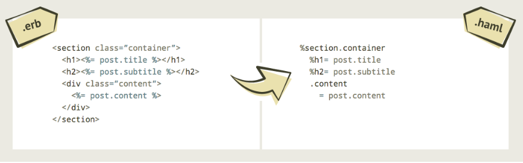
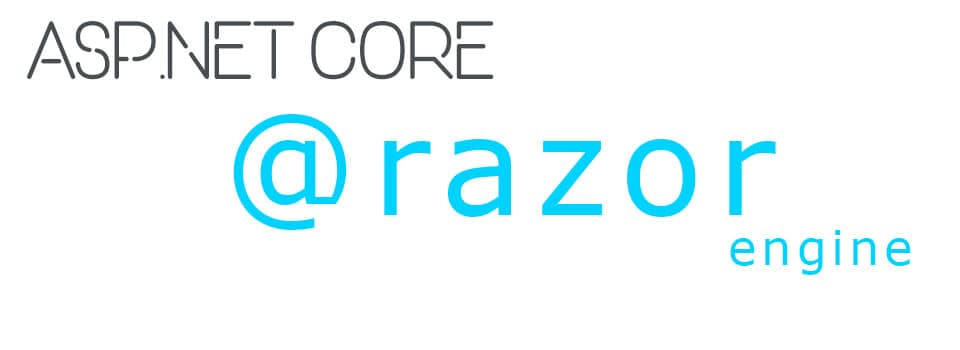
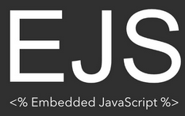
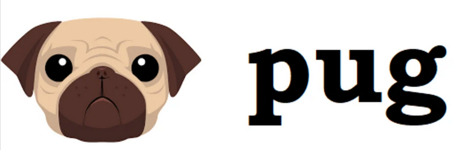

title: CMPS 369 - Templates
---
class: center, middle, title_slide
# HTML Templates w/ PUG
## CMPS 369

---
# Motivation
This isn't how HTML should be written....

```js
const table = (list, props) => {
    let headers = '';
    let data = ''
    props.forEach((p) => headers += `<th>${p.toUpperCase()}</th>`);
    for (const t of list) {
        data += '<tr>';
        props.forEach((p) => {
            if (p === 'logo') {
                data += `<td></td>`
            } else {
                data += `<td>${t[p]}</td>`
            }
        });
        data += "</tr>";
    }
    return `<table><thead><tr>` + headers + '</thead><tbody>' + data + '</tbody></table>';
}
```


---
# MVC
The Model View Controller architecture has been around for decades, and comes in many forms - and it is **successfull**.  The premise is that you want to separate your application *logicall* into three parts:

- **Model** - the data (to be viewed and manipulated)
- **View** - declaratively written presentation / UI (HTML)
- **Controller** - procedural control (JavaScript)

The separation is not strict - and not perfect - but it is a far better approach to designing application architecture.

---
# The right representation 
Put simply, mixing controller, model, and view code leads you to using the wrong representation (and language) for the job.

Today we focus on **presentation**.  Instead of using JavaScript to build HTML through string concatenation, we limit JavaScript to **computing the model** that must be presented.

We will use HTML *templates* to create declarative syntax for **rendering** the model.

---
# What's a template
A template is mostly HTML, with **hooks** for data.  Most template languages support basic **conditionals** and **loops**, along with facilities for reusability - sort of like **functions**.

Example:  **EJS**
.split-left[
```html
<% for ( q in post ) { %>
	<li>
		<%= q %> -> <%= post[q] %>
	</li>
<% } %>
```
]
.split-right[
EJS (Embedded JavaScript) uses `<%` and `%>` to embed JavaScript into what otherwise looks like HTML.

It's the inverse of string concatenation - which embeds HTML inside JavaScript!
]

---
# We can do better
Template languages started with things like EJS - using traditional HTML syntax, with control logic sprinkled in... however - developers came to realize something about HTML... **it's tedious**.

.callout[
  HTML was invented to be easy for non-programmers to write.  It was also created in a way that was easy to parse.  Over the years, the web evolved - and HTML isn't written by non-programmers, and we have really good parsers...
]

---
# Rails &amp; HAML
The Ruby on Rails framework popularized a more readable, and structured approach to writing HTML templates - using **HAML** - **H**TML **A**bstraction **M**arkup **L**anguage 



---
# Key Differences
- No < and > for elements
- Element names appear as first thing on line
- No need to close the element
- New lines are meaningful
- Indentation is meaningful (establishes child relationship
- Common attributes can be written in shorthand
- Elements like span/div don’t need to be written!

---
# Templates are everywhere
We will be using one template engine (PUG), but there are tons of them.  HTML template languages are available for any language your develop web servers for.








---
# PUG
Templates take a set of variables to include in creating HTML.
```json
{
  title: 'CMPS 369', 
  areYouUsingPug: true
}
```
.split-left[
  PUG Template
```pug
doctype html
html(lang="en")
  head
    title #{title}
  body
    h1 PUG Demo
    if areYouUsingPug
      p You are amazing!
    else
      p This could have been easier for you 
```
]

.split-right[
  Corresponding HTML

  ```html
  <!doctype html>
  <html lang="en">
    <head>
      <title>CMPS 369</title>
    </head>
    <body>
      <h1>PUG Demo</h1>
      <p>You are amazing!</p>
    </body>
  </html>
  ```
]

---
# How do you get HTML?
```
npm install pug
```
.split-left[
```js
const pug = require('pug');
const template = pug.compileFile('./demo.pug');
const model = {
  title: 'CMPS 369', 
  areYouUsingPug: true
}
const html = template(model);
//send HTML to browser
```
]
.split-right[
demo.pug
```pug
doctype html
html(lang="en")
  head
    title #{title}
  body
    h1 PUG Demo
    if areYouUsingPug
      p You are amazing!
    else
      p This could have been easier for you 
```
]

---
# PUG is serverside
.callout[
  Remember - PUG never goes to the browser!  PUG is a template language.  Templates are combined with **data** and PRODUCE HTML strings.  You send the HTML string to the browser!
]

---
# Quick Language Reference - Attributes
```pug
a(href='google.com') Google
a(class='button', href='google.com') Google
input(type='checkbox', checked)
input(type='checkbox', checked=true)
input(type='checkbox', checked=false)
```
```html
<a href="google.com">Google</a>
<a href="google.com" class="button">Google</a>
<input type='checkbox' checked/>
<input type='checkbox' checked/>
<input type='checkbox'/>
```

---
# Quick Language Reference - Special Attributes
```pug
a(style={color: 'red', background: 'green'})
//- Comments start with //-
//- Lines starting with - are pure JavaScript
- var classes = ['foo', 'bar', 'baz']
a(class=classes)
a.bing(class='classes', class=['boo'])
```
```html
<a style="color:red;background:green"></a>
<a class="foo bar baz"></a>
<a class="bing foo bar baz boo"></a>
```
---
# Quick Language Reference - Shorthand Attributes
```pug
a.button Foo
.content Bar
a#main Baz
#secondary Bing
```
```html
<a class='button'>Foo</a>
<div class='content'>Bar</div>
<a id="main">Baz</a>
<div id="secondary">Bing</div>
```
---
# Quick Language Reference - Blocks
```pug
ul
  li Item A
  li Item B
  li Item C
img
a: img
```
```html
<ul>
  <li>Item A</li>
  <li>Item B</li>
  <li>Item C</li>
</ul>

<a>
  
</a>
  
```
---
# Mixing
```
| Plain text can include <strong>html</strong>
p
  | The pipe symbol must be on new line
p Text can be inlined
p. 
  Long text can be multiline
  if . is suffixed
```
```html
<p>Plain text can include <string>html</strong></p>
<p>The pipe symbol must be on a new line</p>
<p>Text can be inlined</p>
<p>Long text can be multiline if a . is suffixed</p>
```
---
# Model Variables
```js
- var a = "foo"
- var b = "bar"
h1= a
h1 #{a}
h1 #{b}
h1 #{a} / #{b}
```
```html
<h1>foo</h1>
<h1>foo</h1>
<h1>bar</h1>
<h1>foo / bar</h1>
```
---
# Conditionals
```js
- var user = {description: "foo bar baz"}
- var auth = false
- var guest = true

#user
  if user.description
    p #{user.description}
  if auth
    p Logged in
  else if gues
    p Guest
  else
    p Who is this!
```
```html
<div id="user">
  <p>foo bar baz</p>
  <p>Guest</p>
</div>
```

---
# Loops
```js
ul
  each val in [1, 2, 3]
    li #{val}
ul
  each val, index in ['zero', 'one', 'two']
    li #{index}: #{val}
```
```html
<ul>
  <li>1</li>
  <li>2</li>
  <li>3</li>
</ul>
<ul>
  <li>0: zero</li>
  <li>1: one</li>
  <li>2: two</li>
</ul>
```

---
# More to come
PUG can do more:
- includes
- mixins (functions)
- template inheritance

.callout[We will see more as we go along, but let's fix our guessing game so we never build HTML with string again!]